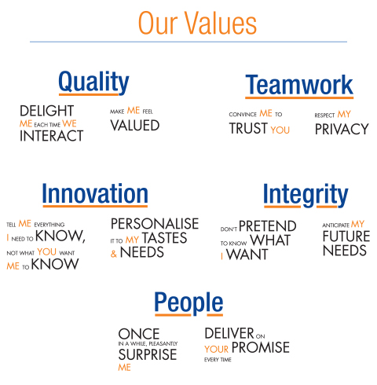

```{r load-packages, include=FALSE}
## You can write as ```{r load-packages, include=FALSE} if you want to hide the particular chunk
## Setting to omitt all warnings
options(warn=-1)

## Loading the packages
if(!'devtools' %in% installed.packages()){
  install.packages('devtools')}
if(!'BBmisc' %in% installed.packages()){
  install.packages('BBmisc')}

suppressPackageStartupMessages(library('BBmisc'))
pkgs <- c('devtools','plyr','dplyr','magrittr','rmarkdown','tidyr','knitr','rmarkdown','lubridate')
suppressAll(lib(pkgs)); rm(pkgs)
```

```{r setting, include=FALSE}
## Make pretty table
## http://kbroman.org/knitr_knutshell/pages/figs_tables.html
## knitr configuration
opts_knit$set(progress=FALSE)
opts_chunk$set(echo=TRUE, message=FALSE, tidy=TRUE, comment=NA, fig.path="figure/", fig.keep="high", fig.width=10, fig.height=6, fig.align="center")
```


## 1. Customer Service Basics


### 1.1 Introduction to Customer Service

`"There is only one boss, and whether a person shines shoes for a living or heads up the biggest corporation in the world, the boss remains the same. It is the customer! The customer is the person who pays everyone's salary and who decides whether a business is going to succeed or fail. In fact, the customer can fire everybody in the company from the chairman (CEO) on down, and he can do it simply by spending his money somewhere else.`

`Literally everything we do, every concept perceived, every technology developed and associate employed, is directed with this one objective clearly in mind – pleasing the customer."`

*by* [**Sam M. Walton, CEO Wal-Mart**](https://en.wikipedia.org/wiki/Sam_Walton)

*Credo from Sam Walton the owner and CEO of Wal-Mart – an international chain of department stores and the most successful company in retailing in the world.*


  You are feel free to browse over [Walmart Global Ethics](https://www.walmartethics.com/Landing.aspx) for more information.



  Scicom believes in providing **Total Customer Delight**. Our mission is to always help our clients get to know their customers better. We help put more than just a face to a name.

*by* [We aim to **DELIGHT** your customers by consistently delivering on our our **PROMISE**](http://www.scicom-intl.com/Total_Customer_Delight.html)

### 1.2 Customer Service in the 21st Century

  Ask any CEO of a company, president of a bank, manager of an office, minister or staff person and they will tell you HOW IMPORTANT the customer is to their operations and success. In meeting after meeting, heads of industry, the service sector, utilities, and government try to convince the audience how much they believe in customer service.

  `"It is our mission, it is our number one priority, it is our goal, it is why we are in business, etc...,"` often prove to be mere epitaphs. Unfortunately, these same **customer friendly** executives go back to their offices, de-employ office staff, fail to initiate a customer service improvement plan and send memos out saying customer complaints are unjustified and overblown.


### 1.3 The Three Key Elements

#### 1.3.1 Expand Your Definition of Service

  How you define service shapes every interaction you have with your customers. Limited definitions of service based on an exchange of monies for goods or service misses the overall point of customer service. **Service** should provide the customer with more than a product or action taken on his/her behalf. It should provide satisfaction. In essence, the customer should walk away pleased at the result of the transaction – not just content but actually happy. A happy customer will continue to be a buying customer and a returning customer.

#### 1.3.2 Who are Your Customers?

  Customers, buyers and clients want to pay a fair price for quality service or products, and feel satisfied they have paid for a service/product and received what they have paid for in return. They also want someone to take care of them. They need someone to understand their needs and help answer them. They need someone to hold their hands and walk them through a process. Customer service starts with the ability to listen to the customer and find out through polite questioning what he/she needs or wants.

  Customer service and contact with a client mean that the customer will be heard and his/her problems will not go unanswered or ignored. It also means getting to know your client, his/her likes-dislikes, ideas, background, etc.

  The other most important aspect to do is to listen to what the customer is saying. If people do not understand what is motivating the customer, they will not be successful in handling them. Do research on customers, their habits, and what they want and expect.

  Most customer service is defined by how a company or organization treats **external customers**, but there is **internal customer service** as well. While this manual mainly addresses **external customers**, expanding your definition of customer service to include coworkers will lead toward even greater success. Remember, the internal customer chain is just like the external, we are all customers both inside and outside the company or organization. As a Wall Street Journal article succinctly put it, `"Poorly Treated Employees Treat Customers Just as Poorly."`

#### 1.3.3 Develop a Customer Friendly Approach

  One commonality among all companies or organizations that provide good service is the development of a system and attitude promoting customer friendly service. By **customer friendly** we mean viewing the customer as the most important part of your job. The cliché, `"The customer is always right"` is derived from this customer friendly environment.

  Two critical qualities to the **Customer Friendly Approach**:

  * Communications
  * Relationships
  
  The two main tasks of successful customer relations are to communicate and develop relationships. They don't take a huge effort, but don’t happen instantaneously either. Positive dialogue/communication with your customers and developing ongoing relationships with your customers are perhaps the two most important qualities to strive for in customer service.

### 1.4 What Customer Service Means

  As mentioned earlier, customer service means providing a quality product or service that satisfies the needs/wants of a customer and keeps them coming back. Good customer service means much more – it means continued success, increased profits, higher job satisfaction, improved company or organization morale, better teamwork, and market expansion of services/products.

  Think about it places where you enjoy doing business – stores, petrol stations, suppliers, banks, etc. Why, aside from the actual product or service they provide, do you like doing business with them? You probably find them courteous, timely, friendly, flexible, interested, and a series of other exemplary qualities. They not only satisfy your needs and help you in your endeavors but make you feel positive and satisfied. You come to rely on their level of service to meet your needs and wants.

  On the other hand, let's review a business you dislike patronizing maybe even hate utilizing but in some cases do so out of necessity. Maybe it is the Police when you need a new driver's license or maybe it is the local store that carries a product you need but who offers lousy service when you purchase. In both of these cases we are willing to hypothesize that the customer experience is marred by long lines, gruff service, inefficient processing, impolite and unfriendly clerks or salespeople, lack of flexibility, and no empathy for your customer plight. In these cases you feel abused, unsatisfied, and taken advantage of – in essence, your experience is wholly negative.

  Unfortunately, in the cases we outlined above there is no competition for the services/products offered or you would gladly not consider using either the Ministry of Transport or the rude department store. This is the advantage of a monopoly on a good or service because in a competitive marketplace, the unsatisfied customer shops elsewhere.

  Remember, good customer service results in consumer satisfaction and return customers and growth in business. Poor customer service, except for monopolistic strongholds, generally results in consumer dissatisfaction, lack of returning customers and dwindling business.

#### 1.4.1 Customer Service Qualities

$$Customer Service = Accountability + Delivery$$

#### 1.4.2 Professional Qualities in Customer Service

  Professionals who constantly deal with customers (inside and outside the company) need to strive for certain qualities to help them answer customer needs.

  The professional qualities of customer service to be emphasized always relate to what the customer wants. After years of polling and market research, it turns out customers are constantly internalizing their customer service experience. What this means is they are grading your customer service during each transaction but you rarely know it. While there are a multitude of customer needs, six basics needs stand out:

 * Friendliness – the most basic and associated with courtesy and politeness.
 * Empathy – the customer needs to know that the service provider appreciates their wants and circumstances.
 * Fairness – the customer wants to feel they receive adequate attention and reasonable answers.
 * Control – the customer wants to feel his/her wants and input has influence on the outcome.
 * Information – customers want to know about products and services but in a pertinent and time-sensitive manner.

  It is also very important for customer service employees to have information about their product or service. Service providers who answer, `"I don’t know"` or `"It is not my department"` are automatically demeaned and demoted in the mind of the customer. These employees can end up feeling hostile as well as unequipped. Customers want information, and they disrespect and distrust the person who is supposed to have information but does not. 

#### 1.4.3 Good Information is Often Good Service

  Employees need to be empowered to satisfy customers. Employees will give bad service to customers if they themselves receive bad service and little feedback from their managers and supervisors. Remember: external customer service starts with internal customer service. 


## 2. Simple Actions Huge Returns

 * Customers will spend up to 10% more for the same product with better service.
 * When customers receive good service they tell 10-12 people on average.
 * When customers receive poor service they tell upwards of 20 people.
 * There is an 82% chance customers will repurchase from a company where they were satisfied.
 * There is a 91% chance that poor service will dissuade a customer from ever going back to a company.

  It is often not what you articulate but how it is presented. What you wear and how you express yourself has a lot to do with how what you say is received.

  Have you ever noticed how a person who is dressed-up, even in older or out-of-style clothing, always commands more authority and respect? The impression they make and what they have to say is enhanced by their personal presentation, facial and hand gestures, as well as the substance of what they have to say. As it turns out, substance is only part of the equation of being persuasive and influencing perception.

  On one level this seems unfair and superficial because what a person says and how they behave should be more important than if they are well groomed, smiling and dressed-up. Yet visual perception plays a vital role in human impressions and reactions. For reasons psychologists do not always understand, nature and learned behavior have taught humans to perceive neat, smiling, well-presented individuals in a more commanding manner.

  It is clear that just looking good will not produce the desired level of customer satisfaction.

 * Smiling – there is nothing like a smile and pleasant face to greet a customer, especially if he/she has a complaint. A smile and polite conversation can immediately disarm a disgruntled customer. Facial expression sets a positive tone before you even begin speaking. A relaxed or pleasant facial expression is the ideal most of the time.
 * Eye contact – always look into your customer's eyes. Directly address customers.
 * How you look – personal grooming has a big impact on your customers. Dirty hands, messy hair and poor dress can mean the loss of an otherwise happy customer. When interacting with customers, dress neatly and in a professional manner so as to command respect and to let customers know you take seriously your position.
 * Shaking hands – when shaking hands with a customer a firm and professional handshake is expected. This part of the greeting is now common among both men and women in a professional environment.
 * Be attentive - when listening to a customer, slightly lean towards your customer and nod your head ever so slightly to indicate you are listening.
 * Tone of voice – always convey friendliness and amicability. Do not raise your voice in frustration or anger no matter how difficult or tiresome a customer may behave. 
 * Hand gestures - use hand movements to emphasize what you say (even on the phone) and to emphasize your feelings.
 * Personal space – this is the distance that feels comfortable between you and another person. If another person approaches you and invades your personal space, you automatically move back without thought. You are uncomfortable. Leave adequate distance between you and your customer. Adequate space is important to making customers feel secure and unthreatened.
 * Posture – slumping in a chair or leaning against a wall while interacting with a customer are sure signs you are not interested in the customer. Your pose or posture should express attention, friendliness, and openness. Lean forward, face the customer and nod to let them know you are interested.
 * Observation - notice how your customer behaves and what he/she reacts positively to while you are providing service.

  Remember, the little, interpersonal actions noted above mean a great deal in the area of customer relations. They can change customer perceptions and ultimately affect the success of your customer relations efforts.


### 2.1 Conversations Over the Telephone

#### 2.1.1 It's Not What You Say, It's How You Say It

  The moment you pick up a telephone, body language and visual perceptions disappear and your tone of voice becomes dominant.

  Almost the entire message you project to the customer over the phone is derived from tone of voice and attitude. For example:

 * A flat tone of voice says to the customer, `"I don’t like my job and would rather be elsewhere."`
 * Slow pitch and presentation say, `"I am sad and lonely – do not bother me."`
 * A high pitch, rapid voice says, `"I am enthusiastic and excited!"`
 * A loud voice says, `"I'm angry and aggressive."`

#### 2.1.2 Telephone Etiquette

  Telephone etiquette, unlike more varying body language, can be uniform and is not culturally based. The telephone is often the first or last place a customer comes in contact with an organization or company. Being telephone friendly is one of the least expensive and costeffective ways to deliver better customer service.

#### 2.1.3 Answering the Telephone

  How a company answers the phone can tell the whole story of how they treat customers and employees. The correct phrase said in the right order in a positive tone leaves a good impression and starts the customer-client relationship off on the right foot.

  Pick up the phone in three rings. More than three rings signals chaos in your office or inattentiveness on the part of your company or organization.

  Greet the caller, e.g. `"hello"`, `"good morning"`. Good manners shows you respect the caller.

  Give your name, e.g., `"Hi, my name is Emma"`. This is a courtesy that serves to personalize the customer service experience as well as allowing the customer to hold you accountable for your level of service. He/she now has a point of reference and someone to contact when he/she calls back.

  Ask the customer if or how you can help. Asking to help tells the customer you are there to serve his/her needs and to solve his/her problems. This also leaves the customer with a positive impression.

  Put it altogether and you have a good example:

`"Good morning, thanks for calling the Insect Farming and Trading Agency, my name is Emma, how may I help you?"`
  
  The greeting is key, it sets the tone and style of the whole interaction.

#### 2.1.4 Troubleshooting

Some things which may upset a customer are simply unavoidable. Here are some tips on how to best handle these situations.

**Putting a Customer on Hold**

  Ask the customer if you can put them on hold; wait for them to say `"yes"` or `"no"` and then explain it will only be for a short period of time. Explain to customers why you are putting them on hold. Thank customers for holding.

**Transferring a Call**

  Ask the customer if they mind being transferred; wait for them to say `"yes"` or `"no"` and explain why they are being transferred and to whom.

**Taking a Message**

  Explain your co-workers absence in a positive light but do not be too specific. Explain that your co-worker is in a meeting, conference, briefing, or training. Do not say he or she is gravely ill, is too hung over to come to work, never called in today, can’t be found, that you do not know where he or she is, or that he or she `"was just here"`.

  Give a reasonable estimate of when the co-worker will return.
  
  Offer to help the caller, take a message or transfer to another staff member.

  If a co-worker is on holiday and will not return to the office for some time, it is permissible to say that he or she is on holiday. However, avoid details such as, `"Raymond is at the beach and I am sure he is having a great time."` While such details may seem innocuous and even humorous, they give the wrong impression to those seeking service.

**Ending the Call**

  This is the final step in good telephone etiquette. A good customer service representative ends the call on a positive note, repeating any actions agreed to be taken and what is going to be done to help or serve the customer.


### 2.2 Respond to your business email quickly!

  Answering your business email promptly should be a priority for all business. Not only is email an important communication line with your customers, it is often used by them to gauge that your trustworthy.

  If a customer sends you an e-mail with a simple question, and you take forever to answer it, what does that say about the rest of your operation? It's one of the tell-tale signs customers use to seperate men from boys. And we all want to play with the big guys, don't we?

  Talking about the big businesses, surveys show that the Top-500 **fail miserably** at answering their business email. Jupiter Communications reported that 42% took more than 5 days to answer a simple question. In the world of Internet, that might as well have been forever. If a customer has to wait that long for an answer, most likely she will have taken their business elsewhere. 35% of companies don't even bother to answer at all. I guess, they just don't like customers ;-) Forrester Research is reporting figures that are similar.

#### 2.2.1 So what is prompt answering your business email?

  Business email should be answered within 24 hours max. **No exceptions**. At that rate, your doing a lot better than a lot of other businesses.

  If you **really** want your customer service to shine, you should consider answering your business email twice a day with a 12 hour interval.

  It is even better to check out your direct competition by sending them an e-mail as if you are a potential customer. Send them more than one on several days. Especially check out mondays, fridays and weekends. Track the time it's taking them to answer, and implement a procedure to beat them at the business email game.

  OK, I understand that for small businesses, resources are limited. But your stream of business email is most likely to be a lot less than for big guns. And if you check and answer e-mail regularly, numbers of e-mails to answer are usually very easy to handle.


### 2.3 First Impressions – You Only Get One

#### 2.3.1 Making a Good First Impression

  Every salesperson in every business knows the importance of making a positive first impression. Sales people know their success and livelihood will depend on how theirpotential customer perceives them in the first 30 seconds of interaction. Good salespeople develop an almost instantaneous rapport with potential customers. Customers like them, follow their advice and then buy their product.

  The reality is that we prefer doing business with those we like and trust. Impressions are the key to developing trust and confidence in the customer.

  As the old saying goes, `"You will never get a second chance to make a first impression."` This is why the first impression is extremely important and can set the tone for all future transactions.

  Here are some ways of creating positive impressions, some of which have already been discussed:

 * Thoughtfulness in meeting the customer's needs
 * Personal responsibility for a customer
 * Quick problem solving for customer
 * Offering immediate assistance
 * Friendliness
 * Using customer’s name in a conversation
 * Pleasant voice tone
 * Polite and courteous manners
 * Neatness
 * A genuine smile

  Here are some factors that create a negative impression:

 * Making the customer wait
 * Not answering the phone promptly
 * Not saying `"please"` and/or `"thank you"`
 * Speaking loudly or condescendingly to customers or colleagues
 * Making faces, frowning, acting distant, not smiling
 * Looking disheveled or like you do not care about your appearance
 * A poor handshake
 * Focusing on another task while addressing or servicing a customer.

Remember, impressions stay with those you meet, especially customers, and once registered; negative impressions are difficult to overcome.


### 2.3 Ten Major Do's and Don'ts of Customer Service

  Every day customer service representatives face situations when what they say makes or breaks a service interaction. Below are ten phrases that should never be used because they frustrate and anger customers.

 * `"No."`
 * `"I don’t know."`
 * `"That’s not my job./That’s not my department."`
 * `"You are right – that is bad"`
 * `"Calm down."`
 * `"I’m busy right now."`
 * `"Call me back."`
 * `"That’s not my fault."`
 * `"You need to talk to my supervisor."`
 * `"You want it by when?"`
 
  **No**: Everyone hates the word `"no"`. It is de -motivating, discouraging, and disinteresting. You will hear this word throughout your life as a customer and as a service provider. `"No"` is tantamount to `"bad service."` `"No"` is easy, cheap, unproductive and negative – it means failure. Unfortunately, “no” is the word we most often hear when a new idea, request or concept is introduced. Admittedly, there are times when you will have to say “no,” but focus on what you can do for the customer (accentuate the positive) and not the negatives of the situation. Better to say `"What I can do is…"` and demonstrate that you care and want to provide quality service despite your current limitations.

  **I don’t know**: Good service means never saying, `"I don't know."` When a customer hears `"I don’t know,"` they hear, `"I don't feel like finding the information you need."` Better to say, `"I'll find out"` or `"Let me look into this and get back to you ASAP."`

  **That's not my job./That's not my department**: When a customer asks you to do something that you do not know how to do or do not have the authority to do, become a catalyst by leading the customer to the person or department who can help him/her solve the problem. Better to say, `"Let me transfer to the person who can immediately help you will this problem."`

  **You're right – that is bad**: Many inexperienced customer service representatives think by sympathizing with the customer's plight, he/she will win over the customer rather than actually doing something to solve the customer's problem. If a customer expresses annoyance or frustration, do not make it worse by commiserating with him/her. Empathize with the customer but seek to solve the problem.

  Likewise, it does not do your company or organization any good to criticize co-workers or other departments within the company or to the customers. All interested parties end up looking unprofessional and inept. Rather try your best to accommodate the customer. Do not promise anything you cannot deliver but do try to serve the customer well. Better to say, `"I understand your frustration, let’s see how we can solve this problem."`

  **Calm down**: When customers are upset or angry let them vent (within reason) and they will eventually calm down. Telling them to **calm down** is belittling, and often serves only to infuriate them further. Better to say, `"I'm sorry."` This is one of the ideal phrases for customer service – it helps to placate the angriest of customers and allows you to begin the process of solving a customer complaint or request and **meet him/her half way**.

  Apologizing does not mean you agree with the customer but it is a means to empathize and move beyond the emotion of the moment and negative impact.

  **I'm busy right now**: It is not easy to juggle customers. You are often helping one customer when another calls or visits your service area. Asking a customer to be patient or politely asking them to wait is very different than putting them off and saying you are too busy to help. Leaving them standing there or on hold are two of the mortal sins of customer service. **Being too busy** is tantamount to saying that you do not care and they are not important. Let the customer know they are important and you are aware of their presence. Better to say, `"I'll be with you in one moment"` or `"Please hold and I'll be right with you."`

**Call me back**: This expression conveys little interest on the part of the customer relation's employee for the needs and wants of the customer. You should always call the customer back because you want their business and are responsive to their requests. Being proactive is part of good customer service.

  **That's not my fault**: If an angry customer accuses you of creating a problem, rightly or wrongly, the natural reaction is to defend oneself. However, this is not the best course of action. The customer has a problem that needs to be solved. By resisting the need to defend yourself, and focusing on the needs of the customer, you can resolve the problem faster and with less stress and confrontation. Better to say, `"Let's see what we can do about this problem."`

  **You Need to Talk to My Supervisor**: This cliché of bad customer service has angered and frustrated customers decades. Customers often ask for things outside the scope of your work or authority – maybe even outside the services/products provided by your company. While passing off these requests to your manager is a tempting option, it is better if you attempt to solve the problem yourself or directly go to the supervisor yourself and get a solution. You become a service hero for the customer and the supervisor. Better to say, `"Let me find that out for you."`

  **You Want it by When?**: Customers often make unrealistic demands, especially when it comes to time. Your first reaction may be annoyance and you may want to make a snide or sarcastic comment. However, the best approach is to hold off on displaying a negative attitude and making a poor impression. Better to say, `"I will call you right back after I find out if that is feasible."`

  **Do not pretend to know what customer needs**: Always asking customer until you know what customer want if you are not realize what does customer think and needs.

**Counter offer**: We may ask customer alternate or substitution if what customer want unable do.

#### 2.3.1 Helpful Reminders for Polite and Friendly Responses

```{r friendly-approach, echo=FALSE}
dfm <- matrix(c('I don\'t know.', 'I\'ll find out.','No.', 'What I can do is...', 'That\'s not my job.', 'Let me find the right person who can help you with...', 'You\'re right - this is bad.', 'I understand your frustrations.', 'That\'s not my fault.', 'Let\'s see what we can do about this.', 'You want it by when?', 'I\'ll try my best.', 'Calm down.', 'I\'m sorry.', 'I\'m busy right now.', 'I\'ll be with you in just a moment.', 'Call me back.', 'I will call you back, what is your telephone ber.'),ncol=2,byrow=TRUE) %>% data.frame
names(dfm) <- c('Wrong Approach', 'Polite and Friendly Alternative')
dfm %>% tbl_df %>% kable
rm(dfm)
```


## 3. Practice what you preach – Dealing with the customer


### 3.1 Communicating with the Unsatisfied Customer

  How many times have you as a customer run into the problem of excuses. There is a problem and the sales person, technician or customer service representative is making lame excuses, namely:

 * It is the fault of the computer.
 * It is the fault of the other sales clerk.
 * It is the fault of the chief of the department.
 * It is the fault of the system.
 * It is the fault of the Government.
 * It is just the way it is.

  Sometimes it feels as if nothing is anybody's fault or is in anybody’s department. This is poor customer service. Good customer service means acc ountability, responsibility and taking action to satisfy the customer.

  Having discussed the importance of knowing how the customer feels and WHAT NOT TO SAY, let's address the notion of how to communicate with an unsatisfied customer.

  If your customer is unsatisfied (for just or unjust reasons), you will have to use some of the many techniques of the customer service professional to win their support and continued loyalty. When coming into contact with a customer, communicating with him/her, or analyzing problems, do not forget to use the following methods or qualities of the customer service professional:

  **Listen**: It is of primary importance when dealing with an unsatisfied or complaining customer to listen attentively to his/her complaint, gripe, frustration or grievance. Be patient, attentive, and friendly.

**Express you are sorry**:

 * `"We are sorry for this mistake/problem."`
 * `"We are terribly sorry for this inconvenience."`
 * `"How can we work to solve this problem together?"`
 * `"I can imagine how frustrated you are."`

**Do not argue and do not interrupt**: This will only worsen the situation, especially if the customer is angry. Let him speak before you try to discuss with him what has happened.

**Do not lose your self-control**: If you stay relaxed, customers will calm down.

**Point out facts**: Listen carefully – and write everything down. Do not make any comments until the customer is finished talking.

**Admit the problem**: If you can suggest a solution, do it. If not tell the customer what actions you will take and what actions will follow. Never make the mistake of promising something you are not able to do.

**Involve the customer in problem solving**: Suggest the customer alternative solutions, if they exist. Customers appreciate the opportunity to choose the ways of problem solving. 

**Follow-up**: Make sure that the promised measures are taken. If you do not fulfill what was promised and ignore the customer's complaint, the problem will grow. Next time it will be more difficult to solve.

**Give the customer a "way back"**: Sometimes customers are wrong. You should let them leave with dignity, without feeling embarrassed.

**Do not question the customer's correctness**: From the very beginning you should believe that the customer may be right. Always be open minded toward the customer's opinion, make them feel they deserve to be listened to.

### 3.2 Solving the Customer's Problems

  When you listen to the customer's complaint you take responsibility to solve the problem.

 * Listen without interruption and with full attention.
 * Behave without aggression, and without arguing.
 * Do not extend excuses for the problem, and thank the customer for drawing their attention to it and helping solve it.
 * Express sympathy and full understanding.

  Customer service problem solving involves:

 * Ask necessary questions to get more complete information and completed picture of a situation
 * Find out exactly what the customer needs you to do for them
 * Explain first what you can do, and then gently add what you cannot do
 * Discuss in detail all opinions, and then decide what needs to be done
 * Undertake immediately what was discussed
 * Check the result to make sure the customer is completely satisfied


### 3.3 Follow -Up with the Customer

#### 3.3.1 It pays to please

  We like companies that treat us well, and some people will even pay more to obtain this. Here are some recent statistics that prove the point:

 * People spend up to 10 percent more for the same product with better service
 * When people receive good service, on average, they tell 11 people
 * When people receive poor service, on average, they tell up to 20 people
 * There is an 80 percent chance that customers will repurchase from a company if their complaint is handled quickly and pleasantly
 * If the service is really poor, 90 percent of customers won’t come back
 
  It is extremely important to make sure that all customer service measures that were discussed or promised are in fact taken. It is not enough for the customer to experience a satisfactory telephone or face-to-face interaction. If nothing comes of the contact they will be even more frustrated and unhappy. Make sure you do whatever you have promised in a timely manner. 

#### 3.3.2 Initiative

  Initiative is the difference between adequate customer service and customer service that wins you a customer for life.

  Everyday examples of exceptional customer service:

 * Taxi driver who opens the door for you or waits at night for you to safely get into your destination.
 * Computer technician who does computer work and then calls back a week later to make sure your IT is functioning well.
 * Car salesperson that calls a month after you buy a car to make sure it is running well.
 * The petrol station attendant who washes your window or checks your oil.
 * The electric company who calls and checks to make sure your service is working well and apologizes for any **brown outs** or **black outs**.

None of these customer service people HAD to make this extra effort or go to this trouble. These **goodwill initiatives** are beyond the call of duty and make the customer beyond satisfied. They make the customer remember the transaction or occasion.


### 3.4 Customer service traits to copy

 * Be on time, open on time, deliver on time
 * Follow through and deliver your promises
 * Go the extra kilometer for customers
 * Offer you customer options
 * Express empathy to upset customers
 * Treat customers as the MOST important part of your job
 * Treat co-workers as if they are customers
 * Give customers your name and contact details


### 3.5 Benefits of good customer service

```{r echo=FALSE}
dfm <- data.frame(c('Providers','','','','','','','','','','','','','Organizations','','','','',''),c('Higher income (more sales, repeat business, referred business)','Recognition','Personal satisfaction & fulfillment','Less stress','Higher self-awareness and self-control','Greater authenticity','Happier life at work','Happier life outside work','More repeat business','More referred business','Fewer returns','Better reputation','Higher morale, happier employees','Lower employee turnover','Fewer complaints','Higher productivity','Better work environment','Higher inventory turnover','Higher profits')); names(dfm) <- c('Beneficiary', 'Benefit'); dfm %>% tbl_df %>% kable; rm(dfm)
```


## 4. Scripts


### 4.1 Greeting scripts

**In-coming call**: `"Welcome to  xxxx, this is Mr/Ms xxx speaking, how can I assist you today?"` (Please salute customer's name 3 times within a call)

**Betting call**: `"Mr/Ms xxxxx, you are placing bet on the match xxx vs xxx, and you are selecting xxx at odds price xxx. Are you confirm?"` (Normally we repeat again what customer said to avoid misunderstand or listen wrongly especial deposit amount, betting selection)

**Deposit call**: `"Mr/Ms xxxxx, could you provide the first 6 and last 4 digits of your debit/credit card for verification purpose?"` (Normally we repeat again what customer said to avoid misunderstand or listen wrongly especial deposit amount, betting selection)

**Withdrawal call**: `"Mr/Ms xxxxx, could you provide below bank details for verification purpose?"` (Bank name, Bank account last 4 digits, Bank holder name, withdrawal amount)

**Put customer on-hold**: `"Mr/Ms xxxxx, please hold-on while I am checking for you now."` (Normally put on-hold less than 3 minutes, and remember inform customer we need to put on-hold somemore minutes if we needed)

**Put customer on-hold**: `"Mr/Ms xxxxx, please hold-on while I am checking for you now."` (Normally put on-hold less than 3 minutes, and remember inform customer we need to put on-hold somemore minutes if we needed)

**End call**: `"Mr/Ms xxxxx, thank you for calling xxx, have a nice day. Good bye"`


### 4.2 Add-hoc

  Do not promise anything that we are not sure. For any issue that we cannot solve within the call, we need to create a case and escalate for getting solution. What we can promise is try to looking for other solution or escalate the case to department incharge if that has over our authority. For any urgent case that we need to call-back, please inform customer that we will call back after 20 or 30 minutes no matter we have found the solution unless customer know the progress of the case. For some non-urgent cases might advice customer feel free to call back to check the case status during our working hours.


### 4.3 Improving the customer service that company provides

  Let say your company faced some rumours or scandals which harmed to reputation and goodwill, it is possible for you to regain the ground that you have lost with dissatisfied customers. This is not only through apologizing and reconciling with the people that have made comments on the insectnet website but through improving your day to day practices.

  Remember that the survival of a company especially new established or small company relies on having satisfied customers. Without them there will be no money coming in and not enough money to keep it a going concern.


## 5. Case Studies

  Here are some [examples](http://rpubs.com/englianhu/customer-service-slideshow) when I worked in [Scicom (MSC) Bhd](http://www.scicom-intl.com/). Some are good but many show that you could be serve customers better.

  I simply refer to [Case Study For Freshers (Level : Medium) – Call Center Optimization](http://www.analyticsvidhya.com/blog/2016/04/case-study-level-medium-call-center-optimization/#comment-109565) and make it interactable webpage instead of statical report. You are feel free to browse over a simple shinyapp below :
  
```{r read-data, echo=FALSE}
## http://www.analyticsvidhya.com/blog/2016/04/case-study-level-medium-call-center-optimization/#comment-109565
suppressMessages(library('plyr'))
suppressMessages(library('dplyr'))
suppressMessages(library('magrittr'))
suppressMessages(library('shiny'))
suppressMessages(library('shinyapps'))
source('function/shinyapp.R')
source('function/kmeans_cluster.R')

lnk <- 'http://www.analyticsvidhya.com/wp-content/uploads/2016/04/Case_Level2.csv'

if(!file.exists('data/Case_Level2.csv')){
  dir.create('data')
  download.file(lnk, destfile='data/Case_Level2.csv')
  }

dat <- tryCatch({
    suppressMessages(read.csv(lnk, stringsAsFactors = FALSE)) %>% tbl_df
  }, error=function(e) {
    suppressMessages(read.csv('data/Case_Level2.csv', stringsAsFactors = FALSE)) %>% tbl_df
    })

rm(lnk)
```

```{r shinyapp, echo = FALSE}
#'@ kmeans_cluster(dat)
runApp(shinyapp(dat), display.mode='showcase')
```


## 6. APPENDICES


### 6.1 Documenting File Creation 

  It's useful to record some information about how your file was created.
  
  * File creation date: 2015-10-29
  * `r R.version.string`
  * R version (short form): `r getRversion()`
  * `rmarkdown` package version: `r packageVersion('rmarkdown')`
  * File version: 1.0.2
  * File latest updated date: `r Sys.Date()`
  * Author Profile: [Ryo®, Eng Lian Hu](http://rpubs.com/englianhu/ryoeng)
  * GitHub: [Source Code](https://github.com/englianhu/customer-service-handbook)
  * Additional session information
  
```{r echo=FALSE, results='asis'}
lubridate::now()
devtools::session_info()$platform
Sys.info()
```


### 6.2 References

1. [Socio-Economics of Sustainable Insect Farming in **Papua New Guinea** - Customer Service Training Manual](http://www.geog.cam.ac.uk/research/projects/insectfarming/StaffCapacityBuilding.pdf)

2. [PROFESSIONAL CUSTOMER SERVICE CASE STUDIES](http://rpubs.com/englianhu/customer-service-slideshow)

3. A lot of skills and knowledge learned from [Scicom (MSC) Bhd](http://www.scicom-intl.com/)


